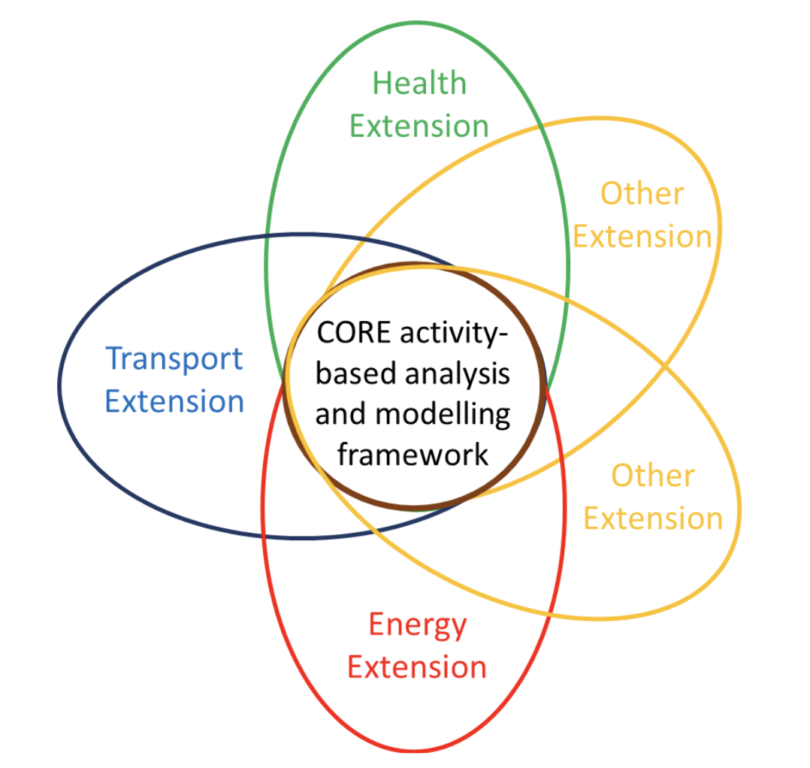

### Core vs Extensions for Different Sectors

The core framework of an activity-based approach puts human needs and the resulting activities at the centre. And depending on where in the above continuum the model is developed, the activity-based model can be used to address questions such as
What are the potential impacts of price signals on the timing and scheduling of consumption activities? (this could apply to energy or transport or any other resource) Appropriate characterisation and modelling of the ‘time’ component of human activities can address this question.

How do personal and social networks impact individual activity patterns and what are the implications of this for resource consumption and wellbeing? This will require appropriate characterisation and modelling of the ‘agent’ component in a manner that allows for interactions between them.

In order to analyse the impacts of a specific policy, or the impacts of a scenario on a specific infrastructure system(s), the activity-based model must be extended beyond this core to incorporate the necessary infrastructure components and variables that can link human activities to the infrastructure and the wider system. The resulting model can then translate human activities to demand for the relevant resources that will be manifested on the corresponding supply/infrastructure networks to determine the system-wide impacts. For instance, if the objective is to analyse the air quality, equity and energy system impacts of a policy targeting large scale electrification of road vehicle fleets, the activity-based model must be extended to include a transport systems component and an energy systems component, and it must represent agents at a level where in-depth equity analysis can be undertaken.

In this manner, extensions of the activity-based model can be developed to address a wide range of policy questions. For example,

- What are the impacts of air pollution on mortality or disease status, and what are the key contributors to this? This can be determined by evaluating the health exposures of agents over the course of the day or week, not only during transport but also while performing activities (e.g. physical activity while cycling, noise pollution at home or air pollution at school). Accordingly, this will require an additional component that can translate exposures over a long period into health implications.
- How will epidemics spread through a community? This can be achieved by linking the model of human activity with travel patterns on transport network, and extending it further to model how diseases spread with exposure in different conditions while traveling and at the destinations.
- To what extent can electric vehicles support renewables in the electricity generation mix, with the use of vehicle to grid technology?

Figure 1 illustrates how the core activity-based model can be extended to consider different infrastructures or combinations of infrastructures, thus supporting more comprehensive appraisals of policies that impact multiple integrated infrastructures. Suggestions for what these extensions may comprise follow.

**Transport** extension: this could go into more detail about transport mode and route choice, and might include goods and services delivered to the home (e.g. parcel deliveries and home care) in lieu of shopping trips, or perhaps in addition to shopping trips that are now used to scope out the available products in the market so that more targeted trips to specific shops will suffice. Compared to the traditional trip and tour-based paradigms used for transport planning and policy, this would enable in-home/ out-of-home activity trade-offs to be considered, as well as trip consolidation through multiple activities being carried out at the same location (e.g. a mall with shops, cinemas, restaurants etc). Induced demand could also be considered, as response to decreased congestion or increased access. This is explored further in Part Two.

**Health** extension: this could develop in several ways. First, by knowing the duration of time spent at different locations, and while travelling, it becomes possible to estimate better rates of exposure to health-harming conditions, such as air and noise pollution, or risk of collisions, or crime exposure. Second, health benefits of physical activity can be attributed to various travel and non-travel activities. Third, mental health benefits could be estimated, by measuring time spent out of doors, in green and blue spaces, and socially interacting with others.

**Energy** extension: this could focus on identifying energy consumption associated with the facilities used to undertake activities including lighting, heating, cooking and the use of machinery and devices, to assess overall energy demand profiles. By determining the fuel source of the energy used (including the prime source of electricity generation), it then becomes possible to estimate total carbon emissions and – by auditing the use of facilities and tools – to include the embedded carbon used in their construction. It also provides opportunities to look at trade-offs between sectors; for example, is it less energy intensive to work from home or travel to work, taking all sources of emissions into account. The energy extension could also explicitly link transport and energy infrastructures by introducing charging infrastructure and networks that represent the electricity demand generated from the charging and discharging activities of electric vehicle ‘agents’.

Other Extensions are also possible, including:

- Identifying other types of resource consumption associated with activity patterns (e.g. water, wastes)
- Measuring consumer expenditure patterns - Identifying wider impacts of digitisation on daily/weekly activity patterns
  · - Examining the (currently unrecognised) impacts of decisions taken in one sector, on others – for example...

...table...
